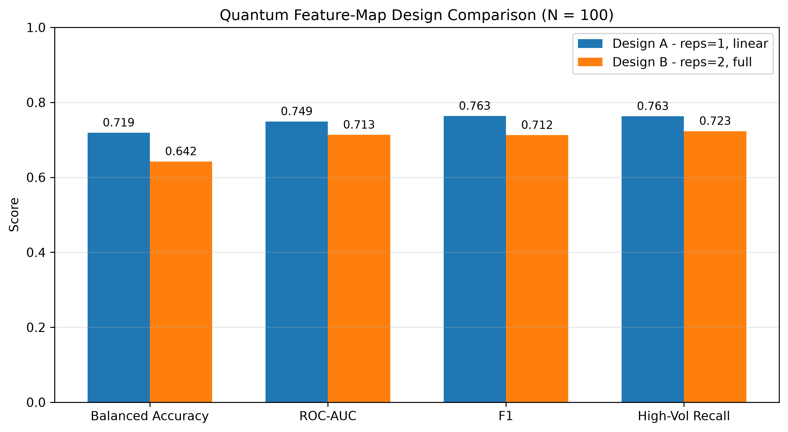
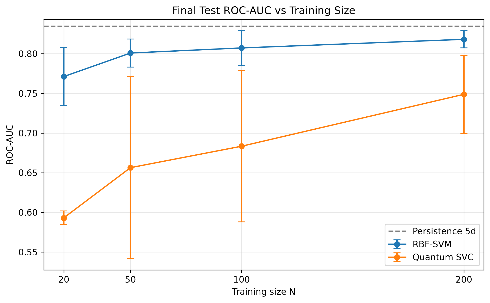
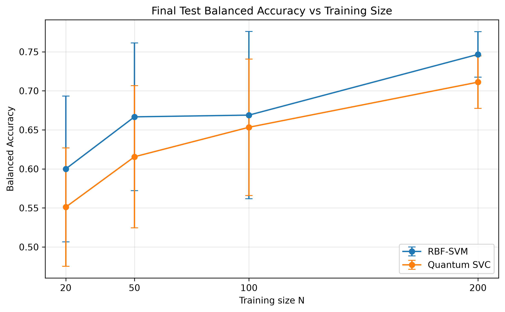
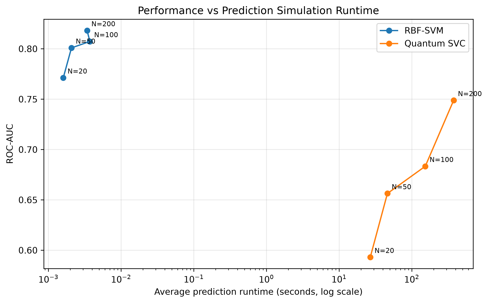

# Q-Regime

**Small-data quantum kernel learning for S&P 500 volatility-regime classification**

Qubit Crew · Qiskit Fall Fest 2026 · University of Ottawa

> **Research question:** Can a Qiskit quantum-kernel classifier identify upcoming high-volatility S&P 500 regimes competitively with a classical RBF-SVM when labeled training data is scarce?

---

## Financial Motivation and Problem Framing

Volatility is one of the most important parameters in quantitative finance. It shapes risk, option prices, position sizing, leverage, and how aggressively a set of positions must be protected when markets turn rough. Trading firms such as Citadel, Jane Street, and Two Sigma operate in markets where the volatility environment is a core input, whatever their exact internal methods.

Take options as a concrete example. An option’s value depends heavily on expected movement, not only on whether the S&P 500 goes up or down. When expected movement rises, option prices change and desks often need more offsetting trades to manage the risk of the position. Those offsetting trades are commonly called hedges: positions taken to reduce damage if the market jumps. In a calm week, a desk may not need as much protection. In a stressed week, waiting too long can get expensive. That is why a short-horizon volatility call matters even if you never try to predict the market’s direction.

Our project studies a simple version of that problem:

> **Given only information available today, is the S&P 500 likely to enter a high-volatility regime over the next five trading days?**

We chose a five-day horizon because it roughly represents one trading week. That is short enough to matter for tactical risk management, and more meaningful than trying to call a single day. We also frame the task as classification rather than predicting an exact volatility number. A risk process usually needs a regime call: treat the next week as stressed or not. The model’s job is to make that call.

The upside of getting this right is operational, not academic. A reliable five-day high-volatility flag is a signal that could support decisions such as reducing exposure, buying protection earlier, tightening risk limits, or adjusting option inventory before stress is obvious in the rear-view mirror. This project does not claim to replace a trading desk’s full volatility stack. It asks whether that regime flag can be learned from a few carefully chosen market features, under the same data limits that make a Qiskit quantum kernel practical to run and interesting to compare with a classical RBF-SVM.

## How the target was built

The project did not begin with the final volatility definition. Our first implementation used five-day volatility calculated from daily close-to-close returns. That gave us a simple starting point and let us build the initial classical and quantum learning pipeline. While reviewing the finance side of the problem, we identified an important weakness: a trading day can swing sharply during the session and still finish close to where it started. In that case, a close-to-close measure can make the day look much calmer than it actually was.

To address this, we moved to range-based volatility estimators that use more of the information available during the trading day. We considered Parkinson, Garman–Klass, and Rogers–Satchell volatility, and selected **Garman–Klass historical volatility** because it uses Open, High, Low, and Close prices. That lets it capture intraday movement that a close-to-close measure can miss.

We obtained 5-day and 20-day Garman–Klass historical volatility from Bloomberg. Before using that data in the final pipeline, we independently reconstructed the 5-day Garman–Klass series from Yahoo Finance OHLC prices. The reconstructed series matched the Bloomberg series almost perfectly on the same dates, which confirmed both the calculation and the time alignment. The Bloomberg file is proprietary and is not in the repository. If it is missing, the notebook recomputes Garman–Klass volatility from public Yahoo OHLC data. Cached quantum results stay tied to the Bloomberg run, so they are not mixed with Yahoo-derived inputs.

We use two volatility horizons because they describe different aspects of the market state. The **5-day** Garman–Klass measure captures the recent short-term environment. The **20-day** measure provides a broader view over roughly one trading month. A sudden spike in short-term volatility can mean one thing in an otherwise calm market, and something different when longer-term volatility is already elevated.

The prediction target is the **future** 5-day Garman–Klass volatility. At each date, the model only receives information that would have been available at that point in time. The outcome is based on volatility realized over the following five trading sessions. A period is labeled high volatility when that future 5-day value sits above the **67th percentile** of the training-period distribution — roughly the top third of historical outcomes the model was allowed to see. That threshold is about **11.22**. It is fit on training data only, so validation and test periods never help define the target.

The split is chronological:

| Split | Period | Role |
|---|---|---|
| Training | 2010–2020 | Fit the threshold, the scaler, and the models |
| Validation | 2021–2022 | Choose features and the quantum feature map |
| Final test | 2023–2024 | Touched only after those choices were locked |

## The four features, and what we left out

Both learned models see the same four inputs:

| Feature | What it captures |
|---|---|
| `return_1d` | The most recent daily log return |
| `momentum_5d` | The sum of log returns over the past five days |
| `gk_vol_5d` | Current short-term Garman–Klass volatility |
| `gk_vol_20d` | Current medium-term Garman–Klass volatility |

Four features also give a natural four-qubit encoding.

We tested VIX and interest-rate features on the validation set before locking that choice.

Adding VIX to the four features changed the kind of mistake the model made. High-volatility recall rose from **0.882** to **0.951**. Balanced accuracy fell from **0.796** to **0.773**, and ROC-AUC from **0.891** to **0.887**. F1 moved slightly up, from **0.842** to **0.847**. The model catches more stressed weeks and also flags more calm weeks as stressed. A volatility-averse desk, one that would rather hedge too early than miss a rough week, could prefer that bias. We did not test it as a trading rule. We left VIX out of the final comparison so both models stay on four features and four qubits, and because the ranking metrics got worse.

The 3-month Treasury yield and the 2-year/10-year spread are a different case. In the seven-feature set they made the validation scores worse overall: balanced accuracy **0.760** and ROC-AUC **0.854**. Those features were rejected.

## Why this becomes a small-data problem

The S&P 500 history contains thousands of trading days. That can create a false sense of abundance. For a five-day volatility regime call, those rows are not thousands of independent lessons.

Nearby labels overlap. Monday’s “next five days” question and Tuesday’s question share most of the same future window, so treating every calendar day as a fresh example double-counts the same market episode. Volatility also arrives in clusters: calm periods and stressed periods come in stretches, not as isolated coin flips. And market regimes change. A model trained on 2010–2020, a stretch that includes both calm years and the 2020 shock, is not automatically prepared for the next stress cycle.

We treat that seriously in the experimental design. First, we thin the data by keeping every fifth observation, so neighboring five-day targets overlap much less. That shrinks the training history from thousands of daily rows to a few hundred more separated examples. Second, we deliberately restrict training further to **20, 50, 100, and 200** labeled observations, repeated across three chronological windows in the 2010–2020 history. Each model is then scored on the same later validation period, and, after the design was locked, on the same 2023–2024 test period.

This matches a practical reality as well as a statistical one. When a new shock arrives, a desk may have only a thin recent window of comparable labeled days before it must act. The question is not only whether a model can learn from a decade of data. It is whether it can still flag an upcoming high-volatility week when the labeled history is scarce. That is also where a quantum kernel is practical to compare with a classical kernel: the kernel matrix grows with the number of training points.

## What the models share

The comparison is fair only if the models see the same problem.

- The same four features
- The same three chronological training windows at each of N = 20, 50, 100, and 200
- The same 2021–2022 validation period and the same 2023–2024 final test
- Features scaled to [0, π] with a min–max scaler fit only inside the relevant training window
- No random train/test split
- A high-volatility threshold fit on training data only

A classical RBF-SVM decides whether two market days are similar with a mathematical kernel. The Qiskit model keeps that learning idea and changes the similarity: each day is encoded into a quantum state, and the overlap between two states becomes the similarity score. A support-vector classifier then learns the high-volatility versus calm boundary from that score.

### How they differ

**Persistence** does not learn a kernel. It ranks each day by volatility already observed today, using either the current 5-day Garman–Klass level or the current 20-day level. This is the financial reference: volatility tends to stay where it is.

**RBF-SVM** uses a classical radial kernel, with C = 1, gamma set to `scale`, and balanced class weights.

**Qiskit quantum kernel** uses four qubits, a ZZ feature map with one repetition and linear entanglement, a fidelity quantum kernel, and a QSVC with the same C and balanced class weights.

The quantum feature map was chosen on validation, before the test set was opened. At N = 100, on the same three windows, a shallow map (one repetition, linear entanglement, circuit depth 11) beat a deeper full-entanglement map (two repetitions, depth 31). The shallow map was also faster on a classical simulator: about 21 seconds to train and 84 seconds to predict, versus about 47 and 194 seconds. Those times are simulator wall-clock times on a classical machine, not quantum-hardware runtimes. The deeper map was slower and less accurate, so the final quantum model is the shallow one.

<p align="center">
  
</p>

## Results

On the 2021–2022 validation set, the four-feature RBF-SVM was a reasonable learned baseline. At N = 100, averaged across the three thinned training windows, its mean ROC-AUC was about **0.898**. The 5-day persistence score on that validation period was **0.859**. At that stage, the learned classical kernel sat above persistence.

The final test is the 2023–2024 period, which was not used to choose features or the feature map. At the largest training budget, N = 200:

| Model | Balanced accuracy | ROC-AUC | F1 | High-vol recall |
|---|---:|---:|---:|---:|
| Persistence, 5-day | 0.780 | 0.835 | 0.667 | 0.680 |
| Persistence, 20-day | 0.680 | 0.742 | 0.519 | 0.560 |
| RBF-SVM | 0.747 | 0.818 | 0.609 | 0.667 |
| Qiskit quantum kernel | 0.711 | 0.749 | 0.552 | 0.680 |

Five-day persistence leads. The RBF-SVM is next. The quantum kernel is third. Its high-volatility recall ties 5-day persistence at 0.680. That is not an overall win: recall depends on the decision threshold, and balanced accuracy, ROC-AUC, and F1 stay lower. Where a result is reported as a spread across the three training windows, that spread is descriptive variability, not a formal confidence interval, because the windows can overlap at larger N.

The quantum scores do improve as the labeled set grows. Mean ROC-AUC rises from about **0.593** at N = 20 to **0.749** at N = 200. It stays below the RBF-SVM at every training size we tested. The validation ranking also does not fully survive the untouched years. On 2021–2022 the RBF-SVM led persistence. On 2023–2024, persistence leads.

<p align="center">
  
</p>

<p align="center">
  
</p>

## Answer

Under this configuration, the answer is no.

A Qiskit quantum-kernel classifier can rank upcoming high-volatility weeks above chance once it has more labeled examples, and its scores rise with the training budget. On the final test it does not match the classical RBF-SVM, and neither learned model matches 5-day persistence. Persistence is the best final-test reference. The RBF-SVM is the better learned model. The quantum kernel did not offset its simulation cost.

<p align="center">
  
</p>

The times in that figure are classical-simulator wall-clock times, not quantum-hardware runtimes. Additional figures are in `results/final_test_prediction_runtime.png`, `results/training_simulation_runtime.png`, `results/final_test_f1_score.png`, and `results/final_test_high_vol_recall.png`.

This is a narrow result. We studied one feature-map family, on a classical simulator, without hardware noise. The three historical windows are chronological, and at larger N they are not fully independent. We did not search for another quantum model after seeing the test set. None of that is a claim against quantum machine learning in general. It says that for this S&P 500 five-day regime task, with these four features and these small labeled sets, the tested quantum kernel did not beat the classical alternatives.

## Future work

Natural next steps are other quantum feature maps, finite-shot and noisy simulation, a run on IBM Quantum hardware, other equity indexes and volatility horizons, and a high-volatility threshold that can move through time.

## Reproducibility

The main notebook is `notebooks/qregime_final_pipeline.ipynb`. A default run loads the saved Bloomberg quantum results (`RUN_EXPENSIVE_QUANTUM = False`). Recomputing those experiments requires `RUN_EXPENSIVE_QUANTUM = True`.

## Testing environment

Python 3.12.10, Qiskit 2.5.2, qiskit-machine-learning 0.9.1, and scikit-learn 1.9.1. The remaining packages are listed in `requirements.txt`.

### Setting up the environment

The following commands should be run in the `qubit-crew_QFF2026_uottawa` folder (Essentially, in the same folder as this README file).

#### Creating the environment
This repository should already include the files of our environment (`qff26`). If this environment is not present, please run this command to create it:

```
python -m venv qff26
```

#### Activating the environment
On Windows
```
.\qff26\Scripts\Activate.ps1 
```

On macOS and Linux
```
source qff26/bin/activate
```

#### Installing the dependencies
```
python -m pip install --upgrade pip
python -m pip install -r requirements.txt
```


## Team

Qubit Crew · Qiskit Fall Fest 2026 · University of Ottawa

- **Aicha:** Contributed to the experimental and evaluation pipeline, including data integration, chronological train/validation/test design, classical RBF-SVM benchmarking, final-test analysis, result visualizations, reproducibility checks, and final notebook integration.
- **Noura:** Contributed to the quantum and notebook implementation, including multiple pipeline functions, Qiskit quantum-kernel experiments, feature-map design comparisons, resource tracking, aggregation of quantum results, and notebook refinements.
- **Yassir:** Contributed to the finance, data, and documentation pipeline, including sourcing and cleaning Bloomberg volatility data, financial problem framing, volatility-measure selection and interpretation, validation of the market-data setup, methodology documentation, and drafting and structuring the project README.

Built for Qiskit Fall Fest 2026 at the University of Ottawa using Qiskit and open-source Python tools.
